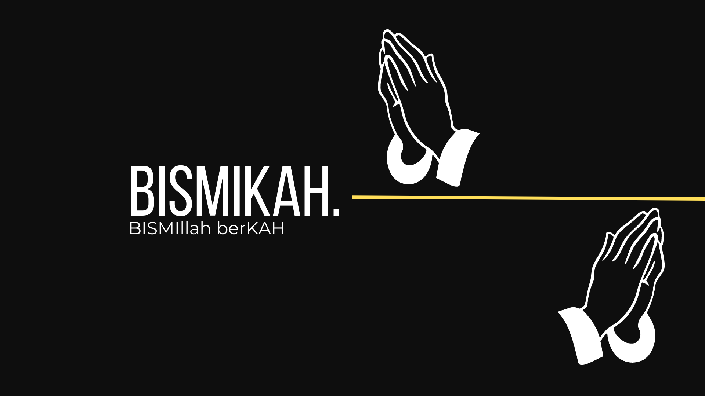

### Hi there 👋

### This is Bismikah Group, Bismikah stands for Bismillah Berkah, so we hope that this group can bring benefits to the enviroment and also to this group members.

 

<h4 style="text-align:center;">So this group formation will be using <i>2 people from MD, 2 people from ML, and 2 people from CC</i></h4>

This is our group members's information for now :

<ul>
  
MD :

  <li>Mohamad Rafi Irfansyah, Information Systems, ITS, <a href="https://www.linkedin.com/in/mohamad-rafi-irfansyah-413551212/">linkedin</a></li>
</ul>
 
<ul>
  
ML :

  <li>Emirsyah Bayu Aji, Information Systems, ITS, <a href="https://www.linkedin.com/in/emirsyahba/">linkedin</a></li>
  <li>Riva Alifiyandono, Mathematics, UNPAR, <a href="https://www.linkedin.com/in/rivaalifyandono/">linkedin</a></li>
</ul>
 
<ul>
  
CC :

  <li>Fitrio Dermawan, Information Systems, ITS, <a href="https://www.linkedin.com/in/fitrio-dermawan-1053b7210/">linkedin</a></li>
</ul>
